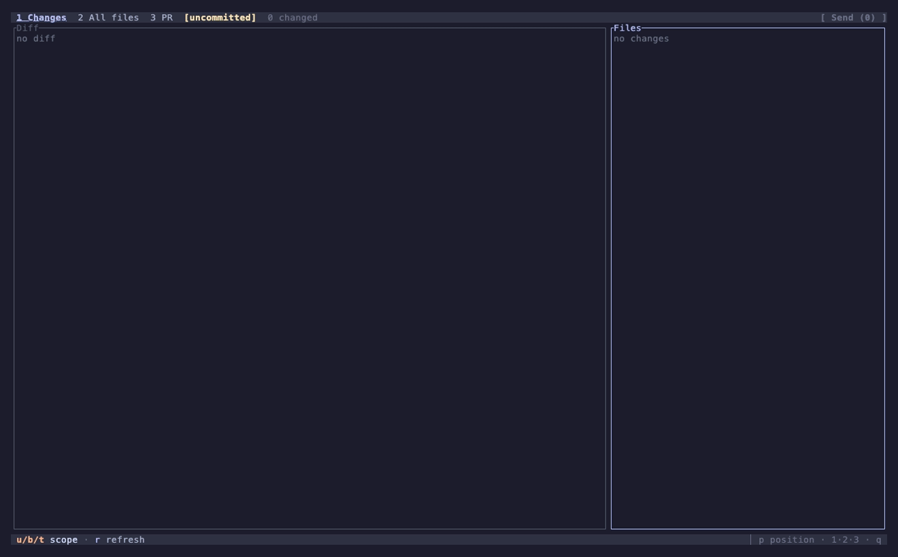

# herdr-reviewr

> **Fork.** This is a fork of [persiyanov/herdr-reviewr](https://github.com/persiyanov/herdr-reviewr),
> maintained at [dcieslak19973/herdr-reviewr](https://github.com/dcieslak19973/herdr-reviewr). Changes
> from upstream: static `musl` builds for Linux releases, and GitLab + Bitbucket Data Center support
> alongside GitHub.

A code-review sidebar for [herdr](https://herdr.dev). Your agent writes the code. You read its
diff in a pane beside the chat, comment on the lines, and send the notes back. You never leave
the terminal.



What you get, in one persistent pane pointed at a git worktree:

- **Diff review** — the agent's changed files, syntax-highlighted, scoped to *uncommitted*,
  *branch*, or *last turn*.
- **Line comments** — select a range and write a note. It stays visible as a card under the code
  instead of hiding behind a marker.
- **Send** — one keystroke drops every comment into the agent's input as
  `path:start-end — comment`. You add context and hit enter.
- **File viewer** — the whole worktree, not just the diff, with any file's current content
  rendered in the pane.
- **PR view** — the branch's open pull request, read-only, without switching windows.
- **Themes** — 18 named palettes in dark and light, one config line away. Catppuccin, Dracula,
  Nord, Gruvbox, Tokyo Night, Rosé Pine, Solarized, and more.

It **never edits your worktree** and sends nothing on its own. It writes only under the repo's git
dir: a private `last-turn` baseline ref under `refs/reviewr/`, and a shared comment store your
agent reads and writes through a few CLI subcommands (see
[Working with agents](#working-with-agents)). The **PR** tab reads your forge — GitHub, GitLab,
or Bitbucket Data Center — but never posts there.

## Requirements

- **herdr ≥ 0.7.5** (the plugin system).
- **git** on `PATH`.
- A **truecolor (24-bit)** terminal with Unicode box-drawing support. Pick a theme that matches
  its light or dark background (see [Theme](#theme)).
- **macOS, Linux, or Windows.**
- A forge CLI or token for the **PR** tab, only for the forge(s) you use — everything else
  works without any of them:
  - **`gh`** (the GitHub CLI), authenticated, for a GitHub origin.
  - **`glab`** (the GitLab CLI), authenticated, for a GitLab origin.
  - **`curl`** on `PATH`, plus a `BITBUCKET_TOKEN` or a `git credential`-stored password, for a
    Bitbucket Data Center origin (see [Bitbucket tokens](#bitbucket-tokens)).

## Install

From the herdr marketplace. You get a prebuilt binary, no Rust toolchain:

```bash
herdr plugin install dcieslak19973/herdr-reviewr
```

> **`Error { kind: NotFound, message: "program not found" }`** during
> `herdr plugin install` means herdr could not spawn `git` — it is not installed or not on
> `PATH` in this shell. Install [Git for Windows](https://gitforwindows.org/) (or
> `git` via your package manager), open a fresh shell, and re-run the install.

The sidebar **auto-opens for a newly created worktree**, so installing the plugin is enough. Set
`auto_open = false` to keep it hidden until you ask (see [Configuration](#configuration)). To
toggle it on demand, bind a key to the **reviewr: toggle sidebar** action in your herdr config.
Keybindings live in user config, not in the plugin manifest:

```toml
[[keys.command]]
key = "cmd+r"
type = "plugin_action"
command = "dcieslak19973.reviewr.toggle"   # <plugin_id>.<action_id> — note the id, not the name
```

`cmd+…` chords reach herdr. macOS swallows `alt+…`. With no key bound, run the action once with
`herdr plugin action invoke toggle --plugin dcieslak19973.reviewr`.

> **Windows:** action ids carry a `-windows` suffix — bind
> `dcieslak19973.reviewr.toggle-windows`, not `.toggle`, and invoke
> `herdr plugin action invoke toggle-windows --plugin dcieslak19973.reviewr`. Same for `open`
> and `close` below.

`install.sh` also symlinks the binary onto `PATH` at `~/.local/bin/herdr-reviewr`, so the `herdr-reviewr` CLI (see [Working with agents](#working-with-agents)) works directly once that directory is on your `PATH`. On Windows, `install.ps1` does not modify `PATH`; it prints the
installed binary's absolute path, so run `herdr-reviewr` commands via that path instead.

Beside `toggle` there are two explicit actions, made for scripts and layout plugins. `open` opens
the sidebar and does nothing when one is already open. `close` closes it and does nothing when none
is. Bind or invoke them the same way, as `dcieslak19973.reviewr.open` and `dcieslak19973.reviewr.close`.
See [Auto-open and layout plugins](#auto-open-and-layout-plugins) for the layout recipe.

## Quick start

The core loop takes five keys. Open the sidebar next to your agent and:

1. **Pick a file.** The agent's changed files are in the right pane. `j` / `k` moves the cursor.
   The diff opens on the left as you go.
2. **Focus the diff.** Press `Tab` to move from the file list into the diff.
3. **Select the lines.** Press `v`, then `j` / `k` to extend the selection (or click-drag).
4. **Comment.** Press `c`, type your note, `Enter` to save. It stays on screen as a card under
   the line.
5. **Send.** When you're done, press `s`. Every comment lands in the agent's input as
   `path:start-end — comment`. You add context and send.

The footer always shows the keys that work right now, so you can learn it by using it. The tables
below are the full reference.

## Controls

**Getting around**

| Key | Action |
| --- | --- |
| `1` `2` `3` | Switch tab — Changes / All files / PR |
| `u` `b` `t` | Switch scope — uncommitted / branch / last turn |
| `j` `k` · `↑` `↓` | Move the cursor in the focused pane |
| `PageUp` `PageDown` | Move a page |
| `Ctrl+U` `Ctrl+D` | Move a half-page |
| `Tab` | Switch focus between the file list and the diff |
| `→` `←` | Expand or collapse a directory or fold, or scroll the diff sideways |
| `w` | Toggle line wrap |
| `]` `[` | Widen / narrow the file list |
| `r` | Refresh now |
| `q` | Quit |

**Reviewing** (in the diff)

| Key | Action |
| --- | --- |
| `v` | Start a line selection, then `j` / `k` to extend (or click-drag) |
| `c` | Comment on the selection — or on the current line |
| `e` `d` | Edit / delete the comment under the cursor |
| `n` `N` | Jump to the next / previous comment |
| `l` | List every comment |
| `s` | Send all comments to the agent |
| `y` | Copy all comments to the clipboard |
| `esc` | Clear the selection |

**In the comments list** (`l`)

| Key | Action |
| --- | --- |
| `j` `k` | Move the highlighted row |
| `e` `d` | Edit / delete the highlighted comment |
| `x` | Resolve / reopen the highlighted comment |
| `h` | Toggle hiding resolved comments |
| `s` `y` | Send / copy, same as in the diff |
| `esc` `l` `q` | Close the list |

**In the comment box**

| Key | Action |
| --- | --- |
| `Enter` | Save the comment |
| `Esc` | Cancel |
| `Shift+Enter` · `Alt+Enter` · `Ctrl+J` | Insert a newline |

Plus the usual caret moves: arrows, `Home` / `End`, `Ctrl+A` / `Ctrl+E`, word-jump with
`Alt+b` / `Alt+f`, and `Ctrl+W` / `Ctrl+U` / `Ctrl+K` to delete by word or to the line edge.

**PR tab** (read-only)

| Key | Action |
| --- | --- |
| `j` `k` | Move through checks and comments |
| `PageUp` `PageDown` | Scroll the selected comment |
| `o` | Open the PR in your browser |
| `r` | Refresh |

herdr is mouse-native, so clicking a file, dragging to select lines, clicking a tab or the `Send`
button, and the scroll wheel all work too.

## The three tabs

- **Changes** — the changed files for the active scope, with `+/-` stats. Pick a file to read its
  syntax-highlighted diff. This is where you review and comment.
- **All files** — the whole worktree tree, not only what changed. The diff pane renders any
  file's current content. Git-ignored paths show too, dimmed. A directory ignored as a whole
  (`target/`, `node_modules/`) is one collapsed row that loads its contents only when you expand
  it. You can comment here as well.
- **PR** — a read-only mirror of the branch's open pull (or merge) request, read from the
  origin's forge: GitHub via `gh`, GitLab via `glab` (shown as **MR**), Bitbucket Data Center via
  `curl`. It shows its state (draft, open, merged, or closed, plus mergeability and
  unpushed-commit sync), its checks with a pass/fail rollup, and its comments. Comments cover
  reviews (GitHub/GitLab), inline findings, and plain comments, newest first, with `resolved` and
  `outdated` markers. `o` opens it in the browser. The tab only reads its forge. It never posts,
  resolves, re-runs, or merges.

## Diff scopes

- **uncommitted** — the working tree vs `HEAD` (staged, unstaged, and untracked).
- **branch** — the working tree vs the merge-base with the base branch. The default base is
  `origin/main`, then `origin/master`, `main`, `master`, set via `base_branches` or `--base`.
  This scope is **uncommitted** plus the branch's committed work.
- **last turn** — only what the agent changed since its most recent turn started (see
  [Limitations](#limitations)).

Every scope respects `.gitignore`, so build output never clutters **Changes**. To review a file,
track it in git. An ignored-but-intentional file (a plan, a sample env) belongs in the repo.
There it shows as a change and ages out once committed. **All files** can still browse any
ignored path, dimmed, even untracked ones.

## Working with agents

Comments aren't only for you to write and send — they're a two-way channel with the coding
agent, backed by one shared store per repo (`<git-dir>/reviewr/comments/`, one JSON file per
comment; see [`specs/review-model.md`](specs/review-model.md)). Your agent reads and writes it
through new subcommands on this same binary; you keep using the TUI exactly as above.

### Install the skill

The universal path works across harnesses — Claude Code, Gemini CLI, GitHub Copilot, OpenCode,
Amp, Codex and more — via the [skills CLI](https://github.com/skills-sh/skills), verified working
against this repo:

```bash
npx skills add dcieslak19973/herdr-reviewr --skill reviewr-comments -g
```

`-g` installs globally (every harness's personal skills directory, e.g.
`~/.claude/skills` for Claude Code); omit it to install per-project instead, into each harness's
project-level directory in the current repo. Either way, once installed it's in every session's
skill list: "address my review comments" works with no `skill-path`/`load that skill` preamble.

If you'd rather not use `npx`, `herdr-reviewr` installs the skill itself, offline, from the
already-installed plugin — no npm required. After `herdr plugin install`, the binary is available
as `herdr-reviewr` *if* `~/.local/bin` is on your `PATH` (`install.sh` links it there; see
[Install](#install)):

```bash
herdr-reviewr skill-install             # ~/.claude/skills/reviewr-comments (Claude Code, personal)
herdr-reviewr skill-install --project   # ./.agents/skills/reviewr-comments (universal, project-level)
```

If `~/.local/bin` isn't on `PATH`, skip the bare command and invoke the plugin action instead,
which runs the same binary by its plugin-root path and needs no `PATH` entry:

```bash
herdr plugin action invoke skill-install --plugin dcieslak19973.reviewr
```

`--project` installs into `.agents/skills/`, the location read by Gemini CLI, GitHub Copilot,
OpenCode, Amp, Antigravity and others (Claude Code reads it too, via the skills ecosystem
tooling; Codex and Cursor also read `.claude/skills/`). Commit that path and every agent session
opened in the repo picks it up, no per-user install step at all. `--project` and `--target` are
mutually exclusive.

Variants, either mode:

- `--copy` installs a real file instead of a symlink (e.g. if your platform or setup makes
  symlinks awkward). Windows falls back to `--copy` behavior automatically, with a note on
  stderr, since it can't always create symlinks.
- `--target <dir>` installs somewhere else entirely, e.g. a specific harness's project-level
  directory:

  ```bash
  herdr-reviewr skill-install --target .claude/skills/reviewr-comments
  ```
- Re-running is idempotent: an unchanged install prints `already installed at <path>` and exits
  0. A conflicting file at the target exits 1 naming it; add `--force` to replace it.

### Make it proactive (CLAUDE.md)

Installing the skill covers "the agent knows how, once asked." It doesn't make the agent check
comments unprompted — for that, put this in your `CLAUDE.md` (loaded every session, unlike the
skill list, which is only consulted when the agent decides it's relevant):

```
Reviews happen in the herdr-reviewr sidebar — when starting work or when review
feedback is mentioned, run `herdr-reviewr comment list` and address open comments.
```

`skill-install` prints this same snippet after a fresh install, as a copy-pasteable reminder.
Without it, the most common failure mode is the agent simply not knowing reviewr exists until
you say so.

### Other agents/harnesses

For agents that read `AGENTS.md` instead of (or in addition to) `CLAUDE.md`, add the same
pointer line there. For anything without a skill system at all, fall back to the generic prompt,
which works in any agent session in the repo:

```
Run `herdr-reviewr skill-path`, load that skill, then review this code and leave
comments in reviewr.
```

Every bare `herdr-reviewr` in these snippets assumes the install-time PATH link (see
[Install](#install)); if the shell can't find it, use the plugin-root path or
`herdr plugin action invoke skill-install --plugin dcieslak19973.reviewr`.

`skill-path` prints the bundled skill's location. The agent loads it, lists your open comments
(`herdr-reviewr comment list`), acts on them, and leaves its own findings as cards in your diff —
you'll see an `agent`-chipped card within a poll tick, no notification needed.

### The reverse flow

Leave comments the usual way (`c`, type, `Enter`), then tell the agent:

```
implement the comments I left in reviewr
```

It runs `herdr-reviewr comment list`, addresses each one, and `comment resolve <id>`s what it
handled. You'll see the card dim in the diff, and — with `h` — disappear from the diff pane
entirely; the comments list (`l`) still shows it, marked `resolved`, so you can reopen it with
`x` if needed.

### `comment_sync`: when your comments become visible to the agent

```toml
# ~/.config/herdr/plugins/config/dcieslak19973.reviewr/config.toml
comment_sync = "immediate"   # default; or "on-send"
```

- **`immediate`** (default) — every comment you save persists to the store right away, so you can
  tell the agent to address your review at any point, not only after a send.
- **`on-send`** — your comments stay pane-local until you press `s`, which persists them (and
  exports as always). Nothing reaches the agent's view of the store before that keystroke, if you
  prefer the older "nothing leaves without a keystroke" posture.
- Either setting is about *your* comments only — the agent's own comments are always written to
  the store immediately and always rendered in your pane, regardless of this key.

Sending (`s`) no longer removes comments from the store: an exported comment stays `open` and
resolvable, so a send doubles as a durable note rather than a one-shot handoff.

## Configuration

CLI flags on the pane command:

| Flag | Default | Meaning |
| --- | --- | --- |
| `--poll <ms>` | `2000` | worktree poll interval (min `200`) |
| `--base <ref>` | auto | base branch for `branch` scope, overrides `base_branches` |
| `--theme <name>` | `catppuccin` | UI + syntax theme (see below) |
| `--wrap <on\|off>` | `on` | soft-wrap long diff lines (`w` toggles at runtime) |

Everything else is set in reviewr's own config file:

```text
~/.config/herdr/plugins/config/dcieslak19973.reviewr/config.toml
```

Create the file if it does not exist yet. herdr hands this directory to the plugin as
`$HERDR_PLUGIN_CONFIG_DIR`, and the path above is where it lives on disk. Note that this is
reviewr's file, not herdr's. Settings added to herdr's own `~/.config/herdr/config.toml` never
reach reviewr.

The file accepts these nine keys:

```toml
theme = "tokyo-night"
base_branches = ["origin/develop", "origin/main", "main", "master"]
toggle_placement = "overlay"
toggle_direction = "down"
auto_open = false
github_host = "github.example.com"
gitlab_host = "gitlab.corp.com"
bitbucket_host = "bitbucket.corp.com"
comment_sync = "on-send"
```

`comment_sync` controls when *your* comments reach the shared store the agent reads — see
[Working with agents](#working-with-agents) above.

A missing file or omitted key uses its default. Any unknown key, wrong type, or invalid value
makes the whole file invalid. reviewr never applies the valid-looking parts. The sidebar then
shows only the config error, and actions or events exit non-zero without touching the workspace.
Fix the file and the running sidebar recovers on its next refresh. Replace the file atomically
if your editor or config manager might expose a partial save.

### Theme

One theme colors the whole UI, chrome and syntax together. Set it in reviewr's config file.
reviewr re-reads the file on refresh, so editing it and refreshing re-themes without a relaunch:

```toml
# ~/.config/herdr/plugins/config/dcieslak19973.reviewr/config.toml
theme = "tokyo-night"
```

`--theme` overrides the config file (handy for a dev run). Pick a name that matches your
terminal's light or dark background. The pane keeps the terminal's background, so a light theme
on a dark terminal reads poorly, and so does the reverse. Available:

- **Dark:** `catppuccin`, `catppuccin-frappe`, `catppuccin-macchiato`, `dracula`, `nord`,
  `gruvbox`, `one-dark`, `solarized`, `monokai`, `tokyo-night`, `rose-pine`.
- **Light:** `catppuccin-latte`, `gruvbox-light`, `one-light`, `solarized-light`, `github-light`,
  `tokyo-night-day`, `rose-pine-dawn`.

Names match herdr's where both ship a palette. An unknown config name is an error. The standalone
`--theme` development flag retains its older fallback to `catppuccin`.

### Base branch

The **branch** scope diffs against the merge-base with a base branch. reviewr tries an ordered
list of candidates and uses the first that exists in your repo, so one setting works across repos
with different trunks. The default is `origin/main`, then `origin/master`, `main`, `master`.

To review against a different base, a `develop` trunk say, set `base_branches` in the same
config file. reviewr re-reads it on refresh, so editing it and pressing `r` re-bases without a
relaunch:

```toml
# ~/.config/herdr/plugins/config/dcieslak19973.reviewr/config.toml
base_branches = ["origin/develop", "origin/main", "main", "master"]
```

reviewr picks the first entry that exists in the repo. A `--base <ref>` flag still wins when it
names an existing ref. A missing file or omitted key uses the default list. A malformed value
blocks the plugin like any other invalid config.

### Forge hosts

GitHub.com and GitLab.com work without configuration. To read pull/merge requests from an
Enterprise or self-hosted instance instead, set that forge's bare hostname:

```toml
github_host = "github.example.com"
gitlab_host = "gitlab.corp.com"
bitbucket_host = "bitbucket.corp.com"
```

reviewr matches either that exact origin host or a trusted SSH alias beginning `<host>-`, such as
`git@github.example.com-work:owner/repo.git`. The alias convention applies only to scp-style and
`ssh://` origins. HTTPS hosts must match exactly. GitHub.com and GitLab.com and their SSH aliases
continue to work when an Enterprise host is configured.

Host identity comes from origin's fetch URL after Git's `url.*.insteadOf` rewrite. A separate
push URL does not change it. API calls name the canonical host on every request, so `GH_HOST`
cannot redirect a fetch. Authenticate the Enterprise or self-hosted host with:

- **GitHub**: `gh auth login --hostname github.example.com`.
- **GitLab**: `glab auth login --hostname gitlab.corp.com`.
- **Bitbucket Data Center**: see [Bitbucket tokens](#bitbucket-tokens) below — there is no CLI
  login step.

There is no `bitbucket_host` default: Bitbucket Cloud (`bitbucket.org`) uses a different API than
Data Center and is not supported. An unconfigured or unrecognized host degrades the same way,
naming the host and the config key that would enable it.

#### Bitbucket tokens

Bitbucket Data Center has no official CLI, so reviewr authenticates with an HTTP access token
instead of a signed-in tool. It resolves the token in order, on every fetch:

1. the `BITBUCKET_TOKEN` environment variable, read fresh each poll so a rotated token takes
   effect without a restart;
2. failing that, `git credential fill` for the origin host, reusing whatever credential helper
   git already has configured.

With neither set, the PR tab shows a remedy naming both options. The token is passed to `curl`
through a config file on stdin, never as a command-line argument, so it never appears in `ps` or
`/proc`.

### Sidebar placement

By default the toggle opens reviewr as a split to the right of your agent. You can change how it
opens by setting `toggle_placement` in the same config file. reviewr re-reads the file on every
toggle, so a change takes effect the next time you press the key.

```toml
# ~/.config/herdr/plugins/config/dcieslak19973.reviewr/config.toml
toggle_placement = "overlay"   # split | overlay | zoomed | tab   (default: split)
toggle_direction = "down"      # right | down — split only        (default: right)
```

- **`split`** sits next to your agent and leaves the keyboard with it. Set `toggle_direction` to
  put reviewr on the right (the default) or below.
- **`overlay`** covers the whole tab with reviewr and hands it the keyboard. Toggle again to drop
  back to your agent.
- **`zoomed`** fills the tab the same way as overlay and hands reviewr the keyboard.
- **`tab`** opens reviewr in its own tab and hands it the keyboard.

When you create a new worktree, reviewr auto-opens only for `split` and `tab`. With `overlay` or
`zoomed` it stays out of the way until you press the toggle yourself. An unrecognized value makes
the config invalid. You can also turn the auto-open off entirely. The next section shows how.

### Auto-open and layout plugins

reviewr auto-opens for every new worktree by default. To make it wait for the toggle key instead,
set `auto_open = false` in the same config file:

```toml
# ~/.config/herdr/plugins/config/dcieslak19973.reviewr/config.toml
auto_open = false   # default: true
```

Do this when another plugin arranges your new worktrees, for example
[herdr-plus](https://github.com/cloudmanic/herdr-plus) worktree layouts. Both plugins react to the
same worktree event and race each other, and either can lose. The race can skip the layout
entirely, or drop reviewr as a split in the middle of it. With `auto_open = false` reviewr leaves
fresh workspaces alone. The layout builds undisturbed, and the toggle key opens reviewr on top of
it in whatever placement you configured.

A layout can also open reviewr itself, once its panes are in place:

```
herdr plugin action invoke open --plugin dcieslak19973.reviewr
```

`open` ignores `auto_open`, because an explicit call is you asking. It opens with your configured
placement and does nothing when a sidebar is already open, so a layout can run it on every pass.
Two things to know. The action opens reviewr in the **focused** workspace, so invoke it while the
new workspace has focus. And it opens reviewr as its **own new pane**. A layout pane whose command
is the invoke will exit once the invoke returns. Run the invoke as a one-shot command from your
layout hook, not as a pane that should stay.

## Limitations

This is a focused, young tool. The known constraints:

**Terminal & theme**
- **Truecolor required** — colors are 24-bit RGB with no 256/8-color fallback. Basic terminals
  render wrong colors.
- **Theme must match the terminal** — the pane keeps the terminal's background, so a light theme
  on a dark terminal reads poorly, and so does the reverse. There is no auto light/dark detection
  yet. You set the theme to match by hand.
- **Add / remove are red / green** — no secondary cue for colorblind users yet.
- **Box-drawing glyphs required** — the UI draws with Unicode box characters. No Nerd Font
  needed.

**Platform**
- **macOS, Linux, and Windows.** Windows needs `git` on `PATH` (ships with
  [Git for Windows](https://gitforwindows.org/)) and herdr 0.7.5+ (older herdrs refuse the
  manifest's `min_herdr_version` with a clear message). On Windows the action ids carry a
  `-windows` suffix — bind keys to `dcieslak19973.reviewr.toggle-windows`, not `.toggle`.
- **Clipboard export** uses `pbcopy` on macOS, or `wl-copy` / `xclip` / `xsel` on Linux. With
  none installed it says so, and **Send** still works. Windows uses the built-in `clip`. OSC 52
  is on the roadmap.
- **Browser open** (the PR tab's `o`) uses `open` on macOS, `xdg-open` on Linux, or `rundll32`
  on Windows — all three ship with their OS, so this needs no install.

**herdr coupling**
- **Send needs a findable agent pane** — the agent in your tab, or the sole agent in the
  workspace. Otherwise Send does nothing and keeps your comments. Browsing and diffing need no
  herdr.
- **last turn relies on polling** (2 s default) — a turn that starts and finishes inside one poll
  never gets its own snapshot. The scope then shows everything since the last *observed* turn
  start. That is never lines the agent didn't write, but possibly more than one turn.

**PR tab (GitHub, GitLab, Bitbucket Data Center)**
- **Read-only, one forge per origin** — needs an authenticated `gh`/`glab`, or a Bitbucket token,
  matching the origin's remote. Without it, it shows one line telling you what to fix, and
  Changes and All files keep working.
- **Mirrors only the branch's *open* PR/MR** — a merged or closed one shows as history. Each
  comment surface caps at one page (100 rows), with a `+more ↗` marker when there is more.

**Review model**
- **Comments persist per repo** once saved, under `comment_sync = "immediate"` (the default) —
  closing the pane or restarting herdr keeps them. Under `"on-send"`, an unsent comment is still
  pane-local only and is lost on close.
- **Sending is all-or-nothing but non-destructive** — Send (or copy-to-clipboard) delivers every
  open, user-authored comment at once. There is no per-comment send and no duplicate delivery, and
  it no longer clears the set: a sent comment stays `open` and resolvable. A failure leaves
  everything in place.
- **No line-number rebasing** — a comment stays locatable by its diff snippet, not its line
  number. reviewr flags a stale comment instead of dropping it.
- **One sidebar per worktree** — two on the same worktree race the baseline ref, and the last
  writer wins.

**Budgets**
- Files over **2 MB** or **50,000 lines** show a "too large" notice. **Binary** files get no
  diff.

## Building from source

For contributors. `herdr plugin link` skips the download build step, so place a locally built
binary where the pane command looks for it, at `$HERDR_PLUGIN_ROOT/bin/herdr-reviewr`:

```bash
git clone https://github.com/dcieslak19973/herdr-reviewr
cd herdr-reviewr
just install   # build release → bin/herdr-reviewr, ad-hoc re-signed on macOS
herdr plugin link .
```

`just install` replaces the binary with a fresh file and ad-hoc re-signs it. On Apple Silicon
that matters. Overwriting a code-signed binary in place invalidates its signature, and macOS then
SIGKILLs it at launch. So a plain `cp target/release/herdr-reviewr bin/` makes the pane open and
close instantly.

**The dev loop** after the first link:

1. Edit the code.
2. Run `just install` to rebuild and re-sign the binary under `bin/`.
3. Relaunch the sidebar by toggling it off and back on with your keybind. The open pane keeps
   running the *old* process until then, so a rebuild alone changes nothing on screen.

This loop works only while the plugin is **linked**, not installed from the marketplace. Check
with `herdr plugin list`. A `github:…` source means the pane runs a *downloaded* binary under
`~/.config/herdr/plugins/github/`, and local rebuilds never appear there no matter how often you
run `just install`. Switch a GitHub install to a dev link:

```bash
herdr plugin uninstall dcieslak19973.reviewr   # config is keyed by id and survives
herdr plugin link .
```

## Roadmap

Customizable keybindings, structured (JSON) export, in-diff search, a side-by-side split view,
mark-file-reviewed, OSC light/dark theme autodetect, more themes (`kanagawa`, `vesper`,
`everforest`, `ayu`, a dark `github`), a `terminal`-following palette, and OSC 52 clipboard.

## Design

The living design lives in [`specs/`](specs/), one concept per doc, always current.

## License

[MIT](LICENSE). Syntax highlighting comes from [syntect](https://github.com/trishume/syntect) and
[two-face](https://github.com/CosmicHorrorDev/two-face). Most themes' syntax colors come from
two-face's bundled set.

Bundled `.tmTheme` syntax files in `assets/`, each under its own license:

- [Catppuccin Mocha](https://github.com/catppuccin/bat) — MIT.
- [Tokyo Night](https://github.com/folke/tokyonight.nvim) (`tokyo-night`, `tokyo-night-day`) — Apache-2.0.
- [Rosé Pine](https://github.com/rose-pine/tm-theme) (`rose-pine`, `rose-pine-dawn`) — MIT.
